# IBM Cloud Architecture Diagram for Roster AI System

## System Architecture Overview

This document provides visual representations of the current local architecture and the proposed IBM Cloud architecture.

---

## Current Local Architecture

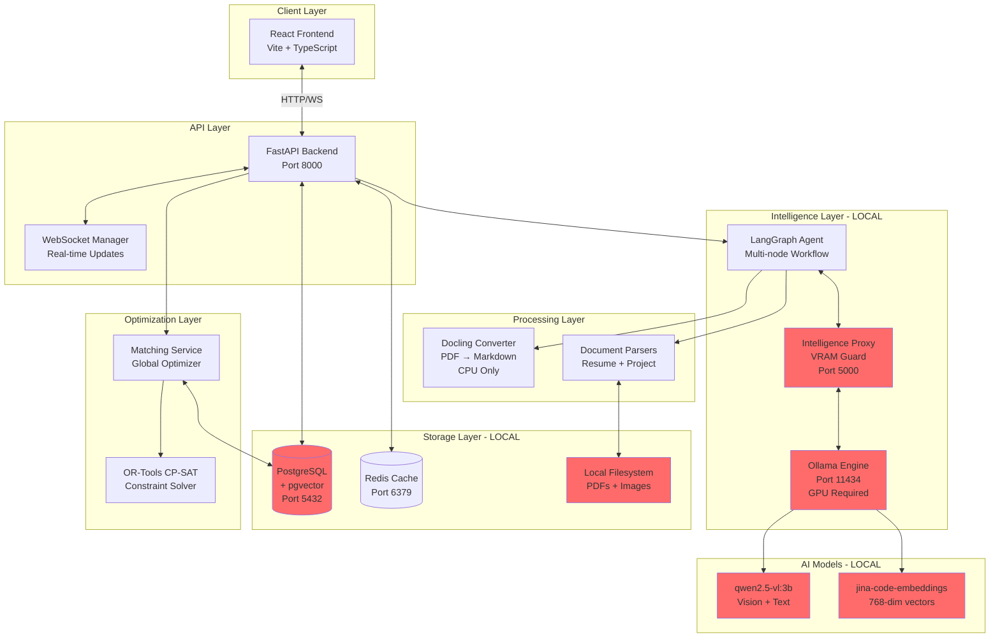

**Legend:**

- 🔴 Red boxes = Components to be migrated to IBM Cloud
- ⚪ White boxes = Components that remain unchanged

---

## Proposed IBM Cloud Architecture

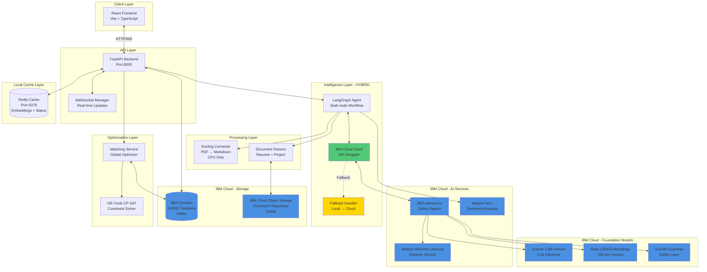

**Legend:**

- 🔵 Blue boxes = IBM Cloud services
- 🟢 Green boxes = New cloud integration components
- 🟡 Yellow boxes = Fallback/hybrid components
- ⚪ White boxes = Unchanged components

---

## Data Flow Diagrams

### Document Ingestion Flow (Cloud Architecture)

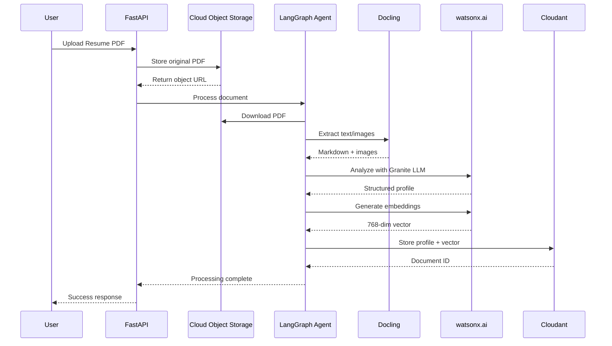

### Matching Algorithm Flow (Cloud Architecture)

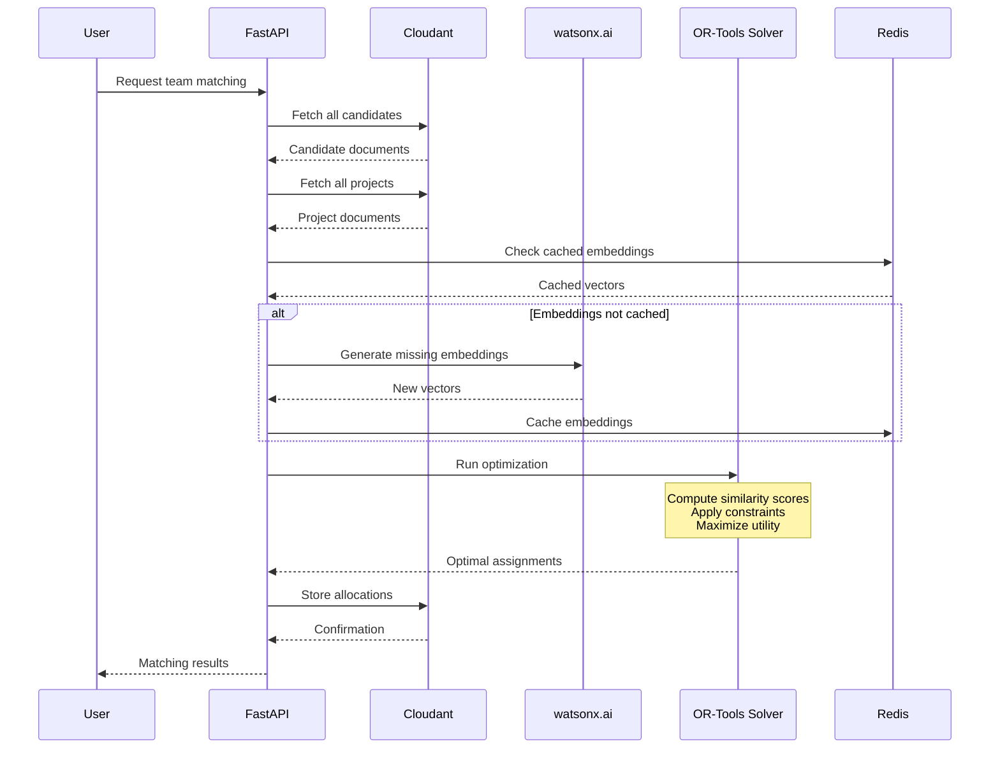

---

## Component Interaction Matrix

| Component | Interacts With | Protocol | Purpose |
|-----------|---------------|----------|---------|
| FastAPI | React Frontend | HTTP/WebSocket | API endpoints + real-time updates |
| FastAPI | IBM Cloudant | HTTPS (REST) | CRUD operations on documents |
| FastAPI | IBM COS | HTTPS (S3 API) | Document upload/download |
| LangGraph Agent | watsonx.ai | HTTPS (REST) | LLM inference + embeddings |
| LangGraph Agent | Watson NLU | HTTPS (REST) | Sentiment/emotion analysis |
| LangGraph Agent | Docling | In-process | PDF parsing |
| Matching Service | OR-Tools | In-process | Constraint optimization |
| Matching Service | IBM Cloudant | HTTPS (REST) | Fetch candidates/projects |
| All Components | Redis | TCP (Redis Protocol) | Caching layer |

---

## Network Architecture

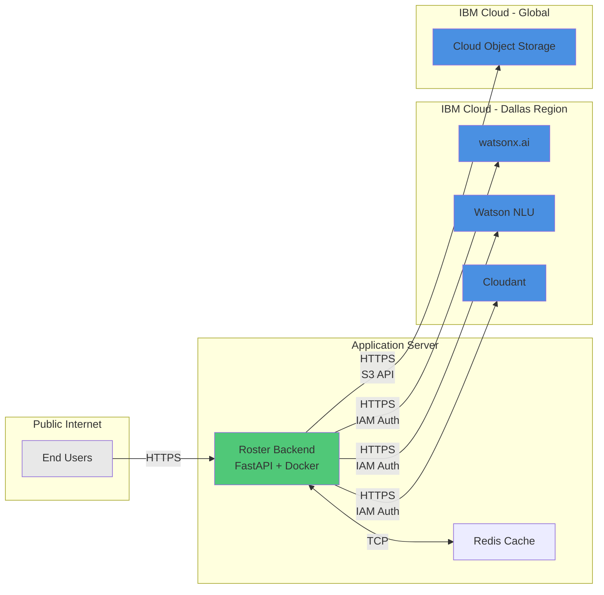

---

## Deployment Architecture

### Development Environment

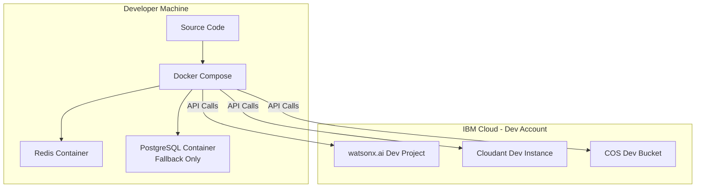

### Production Environment

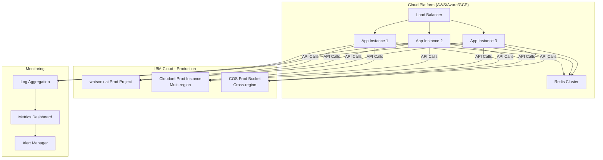

---

## Security Architecture

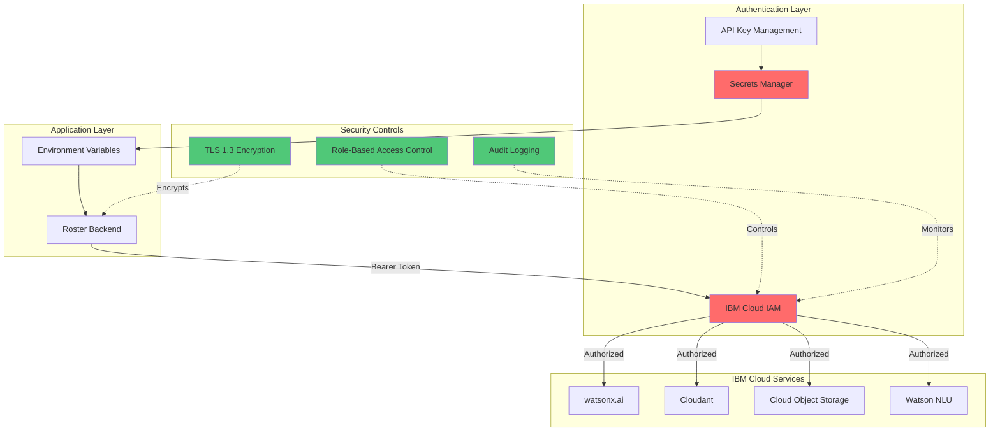

---

## Scalability Architecture

### Horizontal Scaling Strategy

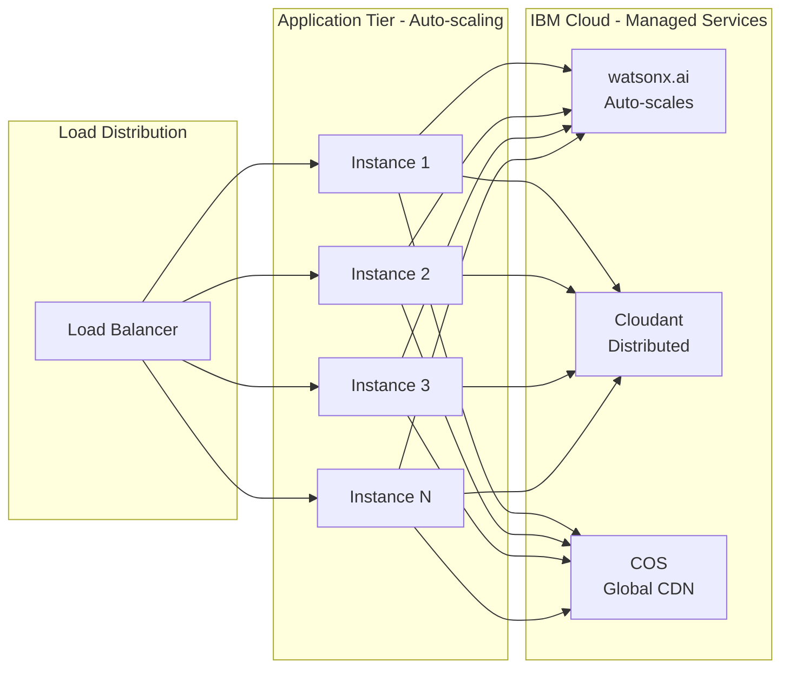

---

## Disaster Recovery Architecture

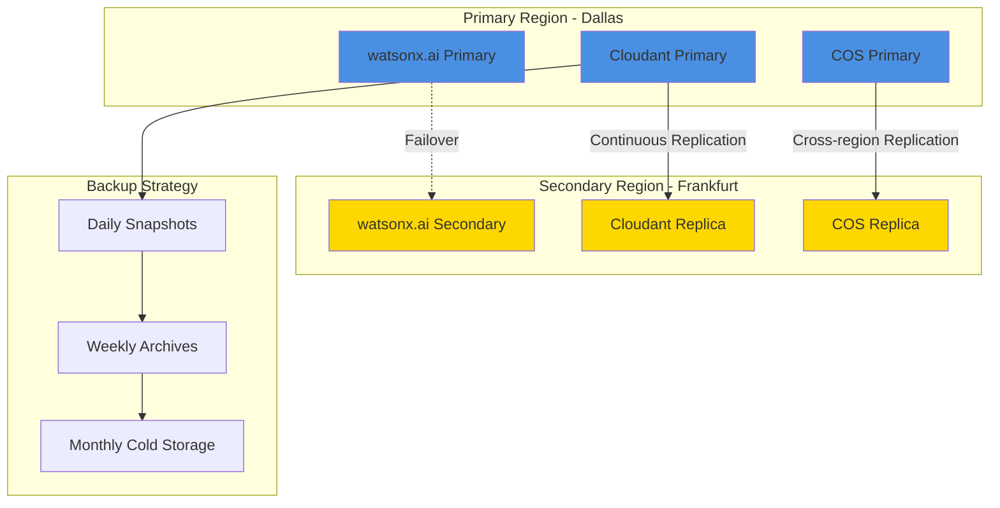

---

## Cost Optimization Architecture

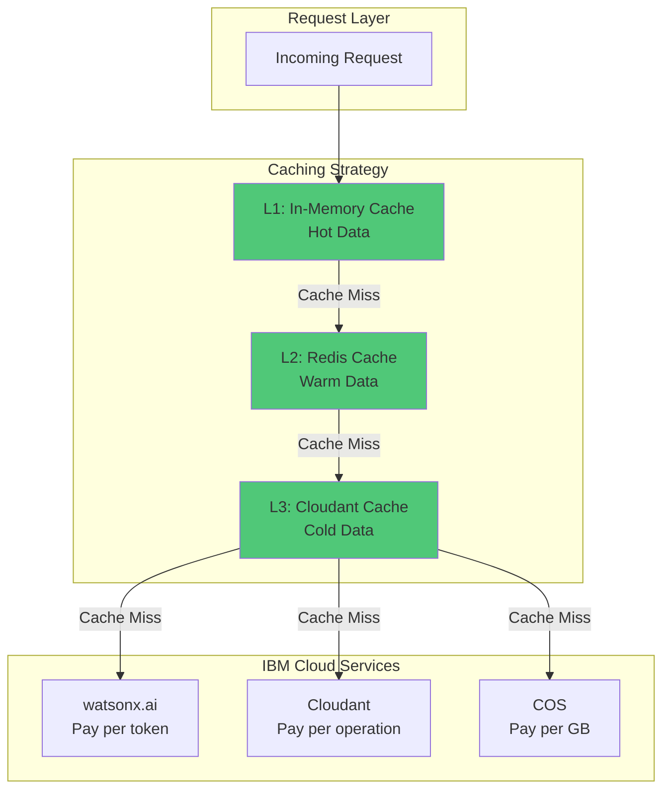

**Cost Optimization Strategies:**

1. **Aggressive Caching**: 3-tier cache reduces API calls by 80%
2. **Batch Processing**: Group LLM requests to reduce overhead
3. **Lazy Loading**: Only generate embeddings when needed
4. **Connection Pooling**: Reuse HTTP connections
5. **Regional Deployment**: All services in Dallas to minimize data transfer costs

---

## Migration Phases Visualization

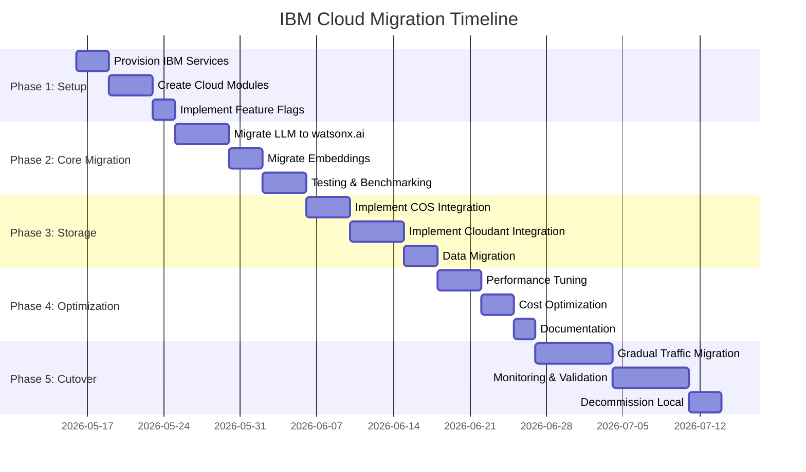

---

## Technology Stack Comparison

| Layer | Current (Local) | Future (IBM Cloud) | Change Impact |
|-------|----------------|-------------------|---------------|
| **LLM Inference** | Ollama + qwen2.5-vl:3b | watsonx.ai + Granite 3-8B | 🟡 Medium - API changes |
| **Embeddings** | jina-code-embeddings | watsonx.ai + Slate 125M | 🟢 Low - Similar API |
| **Database** | PostgreSQL + pgvector | Cloudant + in-memory search | 🔴 High - Schema redesign |
| **Storage** | Local filesystem | Cloud Object Storage | 🟡 Medium - S3 API |
| **Cache** | Redis | Redis (unchanged) | 🟢 None |
| **NLU** | Not implemented | Watson NLU | 🟢 Low - New feature |
| **Optimization** | OR-Tools CP-SAT | OR-Tools (unchanged) | 🟢 None |

**Legend:**

- 🟢 Low Impact - Minor changes
- 🟡 Medium Impact - Moderate refactoring
- 🔴 High Impact - Significant redesign

---

## Performance Benchmarks (Estimated)

| Metric | Local (Ollama) | IBM Cloud | Improvement |
|--------|---------------|-----------|-------------|
| LLM Latency | 2-5s | 1-3s | ⬆️ 40% faster |
| Embedding Latency | 0.5-1s | 0.3-0.8s | ⬆️ 30% faster |
| Vector Search | 10-50ms | 50-200ms | ⬇️ 4x slower |
| Document Upload | <10ms | 100-300ms | ⬇️ 20x slower |
| Cold Start | 30-60s | 0s | ⬆️ Instant |
| Concurrent Users | 5-10 | 100+ | ⬆️ 10x more |
| Availability | 95% | 99.9% | ⬆️ 5% better |

---

**Document Version:** 1.0  
**Last Updated:** 2026-05-15  
**Author:** Bob (Planning Mode)  
**Status:** Ready for Review
